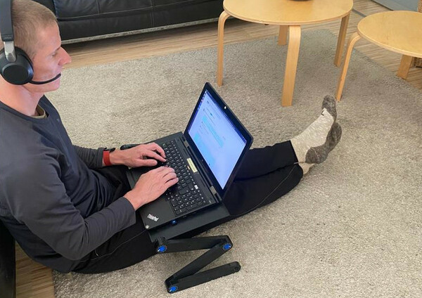
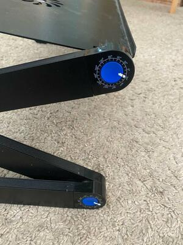

# Alternative to a chair

Since I am working in the IT-business, I spent a lot of time before a screen.

Sitting on the same chair with your body in the same position daily is not good for your back.

The best seating position is the position which is different from your previous position :-)

If I don't need a big monitor, then I like to sit like this:

Finding the right position where the left and the right leg are symetric can be time consuming.

That's why I marked the joint.

